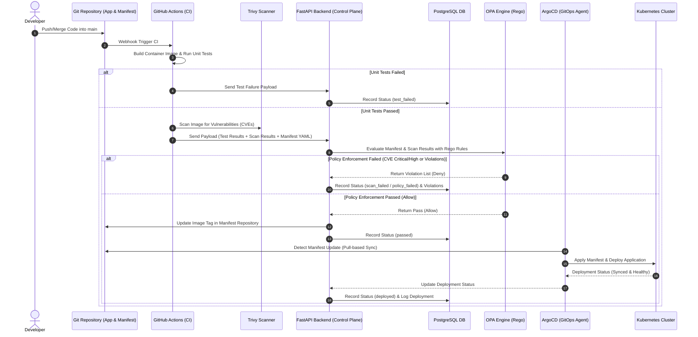
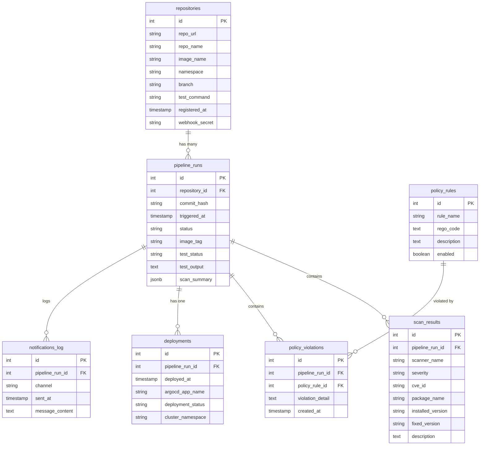

# Context & Specification: Automated Software Delivery System with GitOps

> **คู่มือบริบทและรายละเอียดทางเทคนิคของโปรเจกต์**  
> สำหรับให้ AI Agent / Developer อ่านทำความเข้าใจสถาปัตยกรรม โครงสร้างฐานข้อมูล Workflow และ Tech Stack เพื่อดำเนินการพัฒนาซอฟต์แวร์ได้อย่างถูกต้องและแม่นยำ

---

## 1. ภาพรวมโปรเจกต์ (Project Overview)

* **ชื่อภาษาไทย:** ระบบอัตโนมัติสำหรับการส่งมอบซอฟต์แวร์ด้วย GitOps
* **ชื่อภาษาอังกฤษ:** Automated Software Delivery System with GitOps
* **แนวคิดหลัก (Core Concept):** 
  โปรเจกต์นี้เป็นการพัฒนาระบบแพลตฟอร์มกลาง (Control Plane & Security Enforcement Platform) ที่ผสานการทำงานระหว่าง **CI/CD Pipeline (GitHub Actions)**, **Container Security Scanner (Trivy)**, **Policy Engine (Open Policy Agent: OPA)** และ **GitOps Delivery (ArgoCD)** เพื่อตรวจสอบความมั่นคงปลอดภัย สแกนช่องโหว่อิมเมจ และบังคับใช้นโยบายความปลอดภัยของไฟล์ตั้งค่า Kubernetes (Policy as Code) ก่อนที่จะอนุมัติให้มีการจัดส่งซอฟต์แวร์ (Deploy) ขึ้นคลัสเตอร์ Kubernetes จริงโดยอัตโนมัติ
* **ขอบเขตสเกล (Scope & Multitenancy):** Single-organization / Single-tenant (ไม่มีระบบ Multi-tenant และไม่มีระบบ Auth สำหรับ MVP)

---

## 2. สถาปัตยกรรมและ Workflow การทำงาน (System Architecture & Integration Flow)

### 2.1 แผนภาพการไหลของข้อมูล (Integration Flow)



### 2.2 ขั้นตอนการทำงานรวบยอด (End-to-End Workflow)
1. **Developer Registration:** ลงทะเบียน Git Repository ผ่าน Web Dashboard โดยระบุ `repo_url`, `image_name`, `namespace`, `test_command`
2. **CI Execution (GitHub Actions):** เมื่อมี Git Push เข้า branch `main`:
   - ทำการ Build Container Image
   - รัน Unit Tests ตามคำสั่ง `test_command` ที่ลงทะเบียนไว้
   - เรียกใช้ Trivy Scanner สแกนหาช่องโหว่ความปลอดภัย (CVEs)
   - ยิง Payload ผลลัพธ์ (Test Status + Trivy Scan Output + Kubernetes YAML Manifest) มายัง Backend API
3. **Policy Evaluation (FastAPI + OPA):**
   - FastAPI รับ Payload แล้วส่งให้ OPA Engine ประเมินตามกฎ Rego
   - OPA ตรวจสอบเงื่อนไข: Unit tests ต้องผ่าน, ไม่มี CVE Critical/High, YAML ต้องมี Resource Limits (`cpu`/`memory`), ห้ามรันด้วย Root (`runAsNonRoot: true`), ใช้อิมเมจจาก Registry ที่อนุญาต
4. **Decision Execution:**
   - **กรณี FAIL:** บันทึก `policy_violations` / `scan_results` ลง PostgreSQL อัปเดตสถานะ pipeline run ใน Web Dashboard และหยุดการส่งมอบทันที
   - **กรณี PASS:** Backend ดำเนินการ Commit & Push แท็กอิมเมจใหม่ไปยัง Git Manifest Repository
5. **GitOps Deployment (ArgoCD):**
   - ArgoCD Agent ที่ติดตั้งอยู่ใน Kubernetes Cluster ตรวจพบความเปลี่ยนแปลงใน Git Manifest Repo (Pull-based Model)
   - ArgoCD สั่ง Sync ปรับปรุงสถานะคอนเทนเนอร์บน Kubernetes Cluster
   - อัปเดตสถานะเป็น `deployed` แสดงผล real-time บน Web Dashboard

---

## 3. สแตกเทคโนโลยี (Tech Stack & Tools - Decoupled Microservices Architecture)

| Layer / Domain | Technology Choice | Details / Description |
| :--- | :--- | :--- |
| **Frontend Dashboard** | **Next.js** (TypeScript) + **Tailwind CSS v4** + **shadcn/ui** | Web Dashboard สำหรับลงทะเบียน Repo, ดู Pipeline History, ดู Scan/Policy Violations และ Real-time Deployment Status |
| **State Management** | **TanStack Query** (React Query) + **Zustand** | TanStack Query จัดการ Server State / Data Fetching และ Zustand จัดการ Client Global State |
| **Database & Data Access** | **PostgreSQL (Supabase)** + **Drizzle ORM** | PostgreSQL บน Supabase มี Drizzle ORM เป็น Type-safe ORM สำหรับหน้า Next.js Dashboard |
| **Control Plane Gateway** | **FastAPI** (Python framework) | RESTful API (Dockerized) รับ Webhook จาก GitHub Actions, เชื่อมต่อ OPA, บันทึก DB และควบคุม Git Manifest Update |
| **Linter & Formatter** | **Biome** | Rust-based Linter & Formatter สำหรับจัดระเบียบโค้ด TypeScript/Next.js อย่างรวดเร็ว |
| **CI Engine** | **GitHub Actions** | ท่อส่งงานอัตโนมัติในการ Build Container, Run Unit Test และ Trigger Trivy Scan |
| **Container Scanner** | **Trivy Scanner** (Aqua Security) | เครื่องมือสแกนหา CVEs ใน Container Image และตรวจวิเคราะห์ Infrastructure as Code (IaC) |
| **Policy Engine** | **Open Policy Agent (OPA)** | Engine ตัดสินใจนโยบายความปลอดภัย (Policy-as-Code) ประเมินผ่านภาษา **Rego** |
| **GitOps Controller** | **ArgoCD** | Declarative GitOps CD Tool สำหรับ Kubernetes (Pull-based Model) |
| **Container Orchestration**| **Kubernetes** (`minikube` / `k3s`) | คลัสเตอร์จำลองสำหรับทดสอบการ Deploy target applications |
| **Deployment & Hosting** | **Vercel** (Dashboard) + **Docker** (FastAPI / OPA) | Deploy Frontend Dashboard บน Vercel และรัน Control Plane Services ผ่าน Docker / Docker Compose |

### 3.1 โครงสร้างโฟลเดอร์โปรเจกต์ (Project Folder Structure)

```
CSC492/
├── dashboard/                  # Next.js Frontend (TypeScript)
│   ├── src/
│   │   ├── app/                # App Router pages (/dashboard, /repositories, /pipelines, /policies)
│   │   ├── components/         # Reusable UI Components (shadcn/ui wrappers, layout)
│   │   ├── lib/                # Utilities, API helpers, constants
│   │   └── db/                 # Drizzle ORM schema & migrations
│   ├── .env.local              # Environment variables (Supabase URL, keys)
│   ├── biome.json              # Biome linter/formatter config
│   └── package.json
├── control-plane/              # FastAPI Backend (Python)
│   ├── app/
│   │   ├── api/                # API route handlers (webhook, health)
│   │   ├── models/             # SQLAlchemy/SQLModel data models
│   │   ├── services/           # Business logic (OPA client, Trivy parser, Git updater)
│   │   └── core/               # Config, dependencies, settings
│   ├── requirements.txt
│   ├── Dockerfile
│   └── .env                    # Environment variables (DB URL, OPA URL, Git token)
├── policies/                   # OPA Rego Rules
│   ├── unit_test.rego
│   ├── cve_threshold.rego
│   ├── run_as_non_root.rego
│   ├── resource_limits.rego
│   └── trusted_registry.rego
├── docker-compose.yml          # FastAPI + OPA containers
├── context.md                  # Project context & specification
├── task.md                     # Task tracking & progress log
└── AGENTS.md                   # AI Agent rules & customizations
```

### 3.2 API Endpoints Specification

**Control Plane Gateway (FastAPI) — Base URL: `http://localhost:8000`**

> Pipeline history is read from the shared PostgreSQL database by Dashboard
> through Drizzle. The endpoints below are reserved for the webhook, deployment
> callback, and health checks; there is no separate read API layer in the MVP.

| Method | Endpoint | Description | Request Body / Params |
| :--- | :--- | :--- | :--- |
| `POST` | `/api/v1/pipeline/webhook` | รับ Payload จาก GitHub Actions (Test + Scan + Manifest) | JSON Payload (ดู Section 2.1) |
| `POST` | `/api/v1/pipeline/deployed` | รับผลยืนยันการ deploy จาก ArgoCD (ต้องมี callback token) | `pipeline_run_id` หรือ `commit_hash` + `image_tag`, ArgoCD status |
| `GET` | `/health` | Health Check Endpoint | — |

**Dashboard (Next.js) — อ่านข้อมูลตรงจาก Supabase DB ผ่าน Drizzle ORM (Server Components / Server Actions)**

| Page Route | Data Source | Description |
| :--- | :--- | :--- |
| `/dashboard` | Drizzle ORM → `pipeline_runs`, `deployments`, `scan_results` | Real-time Deployment Status Overview + Analytics Charts (Pass/Fail Rate, CVE Trend) |
| `/repositories` | Drizzle ORM → `repositories` | CRUD Git Repositories |
| `/pipelines` | Drizzle ORM → `pipeline_runs` | Pipeline History & Audit Logs |
| `/pipelines/[id]` | Drizzle ORM → `scan_results`, `policy_violations` | Scan Details, Violations & Remediation |
| `/policies` | Drizzle ORM → `policy_rules` | Toggle OPA Rules On/Off |

### 3.3 รูปแบบการสื่อสารระหว่าง Dashboard และ Control Plane (Communication Pattern)

* **Shared Database Pattern:** ทั้ง Dashboard (Next.js) และ Control Plane (FastAPI) เชื่อมต่อกับ **PostgreSQL (Supabase) ตัวเดียวกัน**
* **Dashboard** อ่านข้อมูลตรงจาก DB ผ่าน **Drizzle ORM** (Server Components) โดยไม่ต้องเรียก FastAPI API — ลด Network Hop และ Coupling
* **Control Plane (FastAPI)** เป็นผู้เขียนข้อมูลหลัก (Write Path) — รับ Webhook, ประเมิน OPA, บันทึกผลลง DB
* **ข้อดี:** เหมาะกับ Single-tenant MVP, ลดความซับซ้อนของ API Layer, Dashboard ใช้ Next.js Server Components อ่าน DB ได้เร็วมาก

---

## 4. โครงสร้างฐานข้อมูล (Database Schema Specifications)

ฐานข้อมูล PostgreSQL ประกอบด้วย **7 ตารางหลัก** (ออกแบบเป็น Single-org/Single-tenant):



### 4.1 รายละเอียดแต่ละตาราง (Table Definitions)

1. **`repositories`**
   - `id` (INT, PK, Auto Increment)
   - `repo_url` (VARCHAR(255), NOT NULL)
   - `repo_name` (VARCHAR(100), NOT NULL)
   - `image_name` (VARCHAR(100), NOT NULL)
   - `namespace` (VARCHAR(50), NOT NULL)
   - `branch` (VARCHAR(50), DEFAULT 'main') — branch ที่ trigger CI
   - `test_command` (VARCHAR(255), NULL)
   - `registered_at` (TIMESTAMP, DEFAULT CURRENT_TIMESTAMP)
   - `webhook_secret` (VARCHAR(100), NOT NULL)

2. **`pipeline_runs`**
   - `id` (INT, PK, Auto Increment)
   - `repository_id` (INT, FK → `repositories.id`)
   - `commit_hash` (VARCHAR(40), NOT NULL)
   - `triggered_at` (TIMESTAMP, DEFAULT CURRENT_TIMESTAMP)
   - `status` (VARCHAR(20), Enum: `pending`, `running`, `test_failed`, `scan_failed`, `policy_failed`, `passed`, `deployed`, `failed`)
   - `image_tag` (VARCHAR(50), NOT NULL)
   - `test_status` (VARCHAR(20), Enum: `passed`, `failed`)
   - `test_output` (TEXT, NULL)
   - `scan_summary` (JSONB, NULL) — สรุปจำนวน CVE แต่ละ Severity เช่น `{"critical": 0, "high": 2, "medium": 5, "low": 10}`

3. **`scan_results`**
   - `id` (INT, PK, Auto Increment)
   - `pipeline_run_id` (INT, FK → `pipeline_runs.id`)
   - `scanner_name` (VARCHAR(50), DEFAULT 'Trivy')
   - `severity` (VARCHAR(20), Enum: `CRITICAL`, `HIGH`, `MEDIUM`, `LOW`)
   - `cve_id` (VARCHAR(50), NOT NULL)
   - `package_name` (VARCHAR(100), NOT NULL)
   - `installed_version` (VARCHAR(50), NULL) — เวอร์ชัน Package ที่มีช่องโหว่
   - `fixed_version` (VARCHAR(50), NULL) — เวอร์ชันที่แก้ไขช่องโหว่แล้ว (สำหรับ Remediation Guide)
   - `description` (TEXT, NULL)

4. **`policy_rules`**
   - `id` (INT, PK, Auto Increment)
   - `rule_name` (VARCHAR(100), NOT NULL)
   - `rego_code` (TEXT, NOT NULL)
   - `description` (TEXT, NULL)
   - `enabled` (BOOLEAN, DEFAULT TRUE)

5. **`policy_violations`**
   - `id` (INT, PK, Auto Increment)
   - `pipeline_run_id` (INT, FK → `pipeline_runs.id`)
   - `policy_rule_id` (INT, FK → `policy_rules.id`)
   - `violation_detail` (TEXT, NOT NULL)
   - `created_at` (TIMESTAMP, DEFAULT CURRENT_TIMESTAMP)

6. **`deployments`**
   - `id` (INT, PK, Auto Increment)
   - `pipeline_run_id` (INT, FK → `pipeline_runs.id`)
   - `deployed_at` (TIMESTAMP, DEFAULT CURRENT_TIMESTAMP)
   - `argocd_app_name` (VARCHAR(100), NOT NULL)
   - `deployment_status` (VARCHAR(20), Enum: `synced`, `degraded`, `failed`)
   - `cluster_namespace` (VARCHAR(50), NOT NULL)

7. **`notifications_log`**
   - `id` (INT, PK, Auto Increment)
   - `pipeline_run_id` (INT, FK → `pipeline_runs.id`)
   - `channel` (VARCHAR(50), DEFAULT 'Web Dashboard')
   - `sent_at` (TIMESTAMP, DEFAULT CURRENT_TIMESTAMP)
   - `message_content` (TEXT, NOT NULL)

---

## 5. กฎนโยบายความปลอดภัยและสถานการณ์ทดสอบ (Security Policies & Scenarios)

### 5.1 เงื่อนไขนโยบาย Rego (OPA Rules Checklist)
- **Unit Test Policy:** ผลลัพธ์ Unit Test ต้องเป็น `passed`
- **CVE Threshold Policy:** ห้ามมีช่องโหว่ระดับ `CRITICAL` หรือ `HIGH` จาก Trivy Scan
- **RunAsNonRoot Policy:** คอนเทนเนอร์ในไฟล์ Manifest ต้องกำหนด `spec.template.spec.securityContext.runAsNonRoot: true` (ห้ามรันด้วยสิทธิ์ Root)
- **Resource Limits Policy:** คอนเทนเนอร์ทุกตัวต้องกำหนด `resources.limits.cpu` และ `resources.limits.memory`
- **Trusted Registry Policy:** อิมเมจต้องดึงมาจาก Container Registry ที่กำหนดเท่านั้น

### 5.2 สถานการณ์การทดสอบหลัก (5 Test Scenarios)
1. **Scenario A (Pass All):** Test Pass + No Critical/High CVE + Valid Limits + Non-Root → **Deployed via ArgoCD**
2. **Scenario B (Unit Test Fail):** Test Fail → **Blocked at CI Stage (test_failed)**
3. **Scenario C (CVE Detected):** Critical/High CVE Found → **Blocked by OPA Policy (scan_failed)**
4. **Scenario D (Missing Limits):** Resource limits missing in YAML → **Blocked by OPA Policy (policy_failed)**
5. **Scenario E (Root Privileges):** `runAsNonRoot: false` in YAML → **Blocked by OPA Policy (policy_failed)**

---

## 6. ข้อกำหนดความต้องการ (Requirements)

### 6.1 Functional Requirements
* **Platform Admin:** ลงทะเบียน/ลบ/แก้ไข Git Repo, เปิด-ปิด Toggle สถานะ OPA Rules, ดูรายละเอียด Violation Reports & Audit Logs, ดูประวัติและสถานะ ArgoCD, ดู Analytics Dashboard (กราฟ Pass/Fail Rate, CVE Trend)
* **Developer:** ดูผลการทดสอบ Unit Test / Trivy Scan / OPA Evaluation บน Web Dashboard, ดู Remediation Guides (คำแนะนำวิธีแก้คอนฟิก/ช่องโหว่), ดูประวัติแยกตาม Commit Hash
* **Security:** Webhook Receiver ต้องตรวจสอบ HMAC Signature (`X-Hub-Signature-256`) ของ Payload ทุกครั้งก่อนประมวลผล เพื่อป้องกัน Payload Spoofing
* **Notification:** บันทึก Notification Log ลงตาราง `notifications_log` ทุกครั้งที่ Pipeline เปลี่ยนสถานะ เพื่อ Audit Trail และการติดตามผ่าน Dashboard

### 6.2 Non-Functional Requirements
* **Security First:** ไม่เก็บกุญแจเข้าถึง Kubernetes Cluster (`kubeconfig`) ไว้นอกคลัสเตอร์ (ใช้ Pull-based GitOps ผ่าน ArgoCD)
* **Performance:** การประเมิน OPA และ Trivy จนถึงแจ้งผลลัพธ์ต้องทำเสร็จภายใน **< 30 วินาที** ต่อรอบการ Push
* **Availability:** Webhook Receiver Backend API ต้องพร้อมรับข้อมูลเสมอ

---

## 7. คำแนะนำสำหรับการพัฒนาโค้ด (Guidelines for AI & Developers)

1. **Separation of Concerns:** 
   - ห้ามนำ Business Logic / Policy Check ไปปนใน UI Component ของ Next.js
   - Backend FastAPI ทำหน้าที่เป็น Control Plane และ API Orchestrator เท่านั้น
2. **Security & Configuration:**
   - ห้าม Hardcode Secret/API Key/DB Password ลงในโค้ด ใช้ไฟล์ `.env` เสมอ
3. **Error Handling:**
   - ห้ามเขียน Empty `catch(error) {}` หรือปล่อยให้ Exception เงียบหาย ทุก Error ต้องบันทึก Log ลง `pipeline_runs` หรือ DB เสมอ
4. **File Length Guideline:**
   - พยายามเขียนไฟล์/Component ไม่เกิน 300 - 500 บรรทัด หากเริ่มยาวให้ทำการ Refactor แยกไฟล์ย่อย
